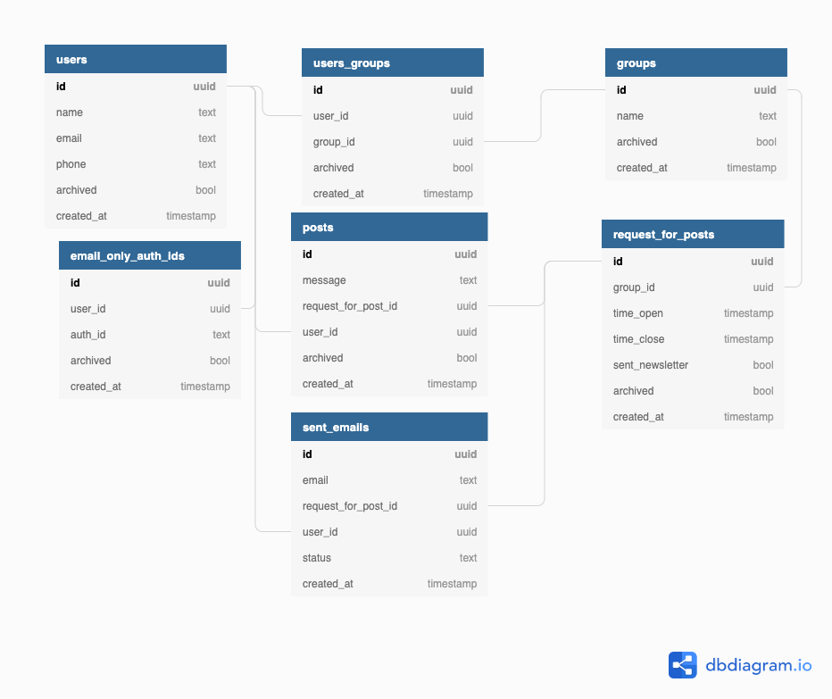
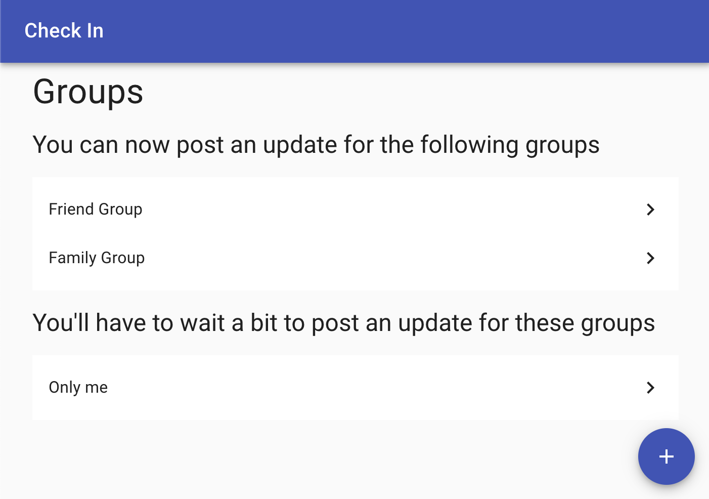
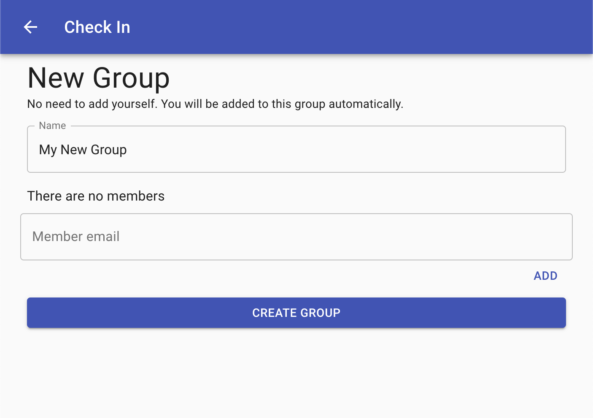
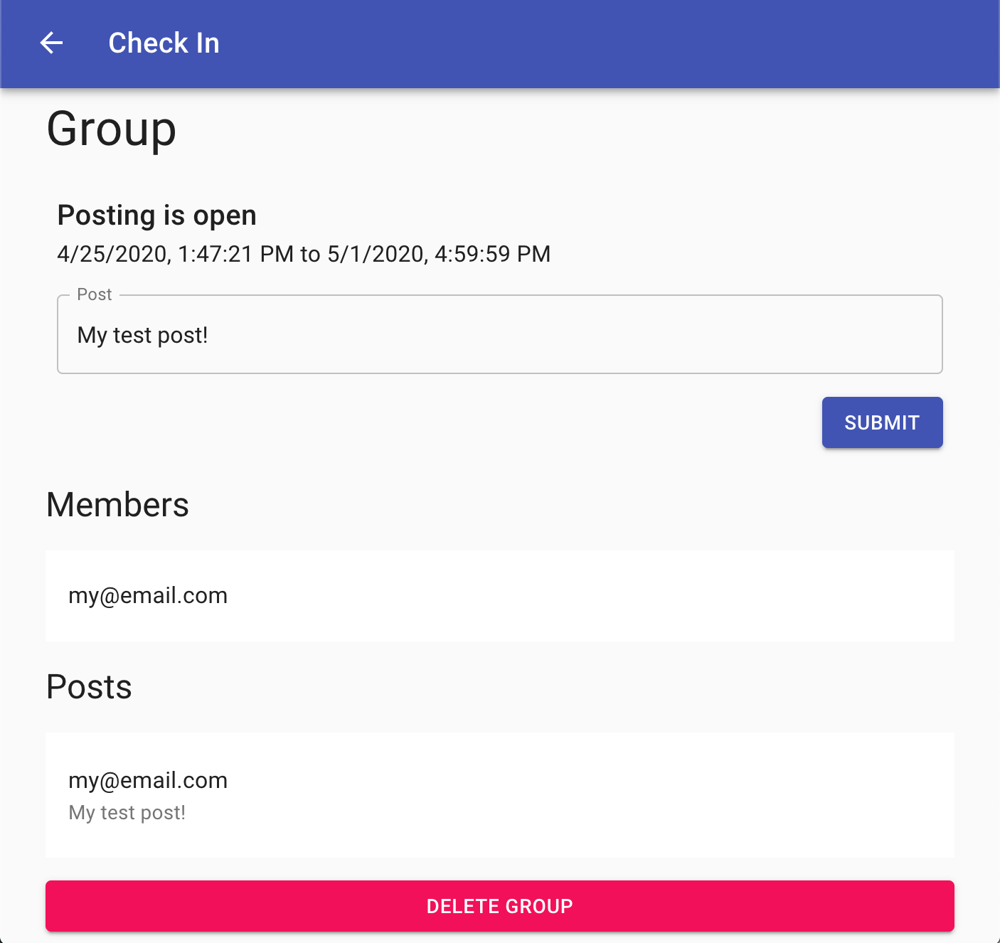
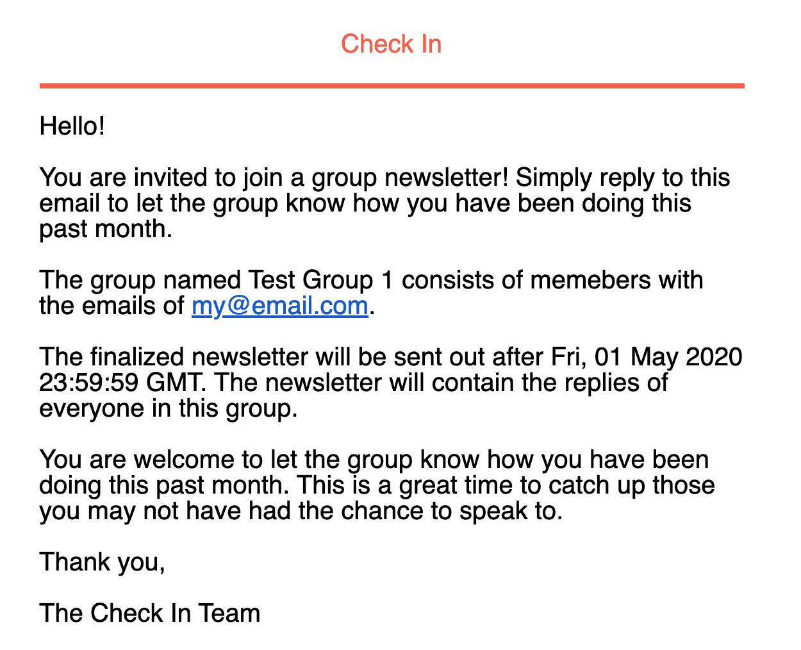
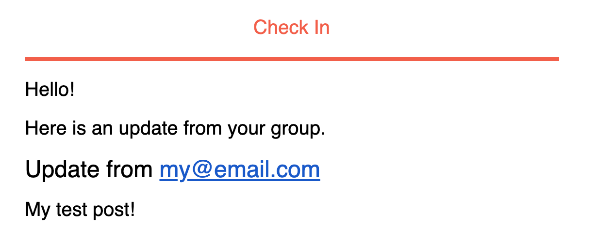

# Check In app for Twilio Hackathon April 2020
Check out the live instance at https://checkin.corymortimer.com/
## About

This is an app developed for the [Twilio Hackathon on DEV](https://dev.to/devteam/announcing-the-twilio-hackathon-on-dev-2lh8). It has been created and developed throughout the month of April.

### How it works

Think of "Check In" as a monthly version of a holiday family card or newsletter. Every month, Check In notifies users that it is time to give an update to the group that they are a part of. Once the update time window has expired, a "newsletter" is sent to everyone in the group that contains each person's submission.

### Software Stack
- PostgreSQL
- Express framework with Node.js
- React framework with JavaScript

## Features

- Create multiple groups specific to your social circles (such as friends and family) to obtain updates from.
- Send updates all from email. The only time a user must use the app is for the initial setup of who to include in the group. The rest can all be done through email.

## Local Set up

### Requirements
- Node 10.16.3 for both backend and frontend (or 12.16.1 for frontend). It is recommened to use [nvm](https://github.com/nvm-sh/nvm#manual-install) to manually switch between node versions.
- [Yarn v1](https://classic.yarnpkg.com/en/docs/install#mac-stable)
- [PostgreSQL](https://www.postgresql.org/download/)

### Environment variables
#### Backend
|Variable|Description|Recommended Local Values|
|---|---|---|
|DB_USER, DB_HOST, DB_DATABASE, DB_PASSWORD, DB_PORT|Database variables to authenticate with PostgreSQL. You may choose to forgo these variables in favor of CONNECTION_STRING.|DB_USER=postgres DB_HOST=localhost DB_DATABASE=check_in DB_PASSWORD=password DB_PORT=5432 (These values depend on your PostgreSQL setup)|
|CONNECTION_STRING|The connection string to connect to PostgreSQL. You may choose to forgo this variable in favor of the db variables above.|Can use values above if not known.|
|SESSION_SECRET|The secret used to sign the session cookie.|testsecret|
|IS_AZURE_FUNCTION|If true, allows the server to be run as an Azure function.|Do not provide this value locally|
|FRONT_END_DOMAIN|The domain where the website is being served from.|http://localhost:3001|
|COOKIE_DOMAIN|The domain for which the cookie should be valid for.|localhost|
|IS_SECURE_COOKIE|If the session cookie should be sent over a secure connection or not.|false|
|PORT|The port that the server runs on. Defaults to 3000 if not specified.|Do not include this variable.|
|SENDGRID_API_KEY|The api key used to send emails through Sendgrid.|Depends on your Sendgrid settings|
|SENDGRID_FROM_EMAIL|The email address where mail should be sent from.|Depends on your Sendgrid settings|
|SENDGRID_REPLY_TO_DOMAIN|The domain that is hooked up with Sendgrid to parse incoming email.|Depends on your Sendgrid settings|
|SERVER_DOMAIN|The domain that the server is running on. It is used for authentication redirection.|http://localhost:3000/api|
|CLIENT_ID|The [DID](https://did.app/) authentication client id.|Please create a test account.|
|CLIENT_SECRET|The [DID](https://did.app/) authentication client secret.|Please create a test account.|
TZ|The timezone for the node application.|UTC|
#### Frontend
|Variable|Description|Recommended Local Values|
|---|---|---|
|REACT_APP_SERVER_DOMAIN|The server domain for the application.|http://localhost:3000/api|
|PORT|The port from which the development server serves the app.|3001|

### Database setup
1. Connect to PostgreSQL `psql postgres`
1. Create a database named `check_in` in PostgreSQL `create database check_in`
1. Connect to the `check_in` database `\c check_in`
1. Run the commands in `init.sql` in order.


### Local development
#### Server
With the environment variables set, run `yarn server` in the `backend` directory.
```
CLIENT_ID=test_id CLIENT_SECRET=test_secret  SESSION_SECRET=testsecret DB_USER=postgres DB_HOST=localhost DB_DATABASE=check_in DB_PASSWORD=password DB_PORT=5432 FRONT_END_DOMAIN=http://localhost:3001 SERVER_DOMAIN=http://localhost:3000/api TZ=UTC SENDGRID_API_KEY=sendgridapikey SENDGRID_FROM_EMAIL=from@domain.com SENDGRID_REPLY_TO_DOMAIN=checkin.domain.com yarn server
```

#### Frontend
With the environment variables set, run `yarn start` in the `frontend` directory.
```
REACT_APP_SERVER_DOMAIN=http://localhost:3000/api PORT=3001 yarn start
```

## Quickstart
1. Click the start here button and enter a valid email to receive the authentication link.
1. Check your email and click the link. You should be brought to the Groups page.
1. Click the plus button in the bottom right hand of the screen.
1. Click "Create Group". A new group with only your email should be created.
1. Check to make sure your group exists in the top section of the groups page. If not, please update the database.
```
psql postgres
\c check_in
UPDATE request_for_posts SET time_open = now();
```
6. See that your group now appears in the top section.
1. Click your group.
1. The ability to add a post should be available. You can go ahead and type something. Make sure to submit it.
1. If you would like to receive an email and you have the Sendgrid credentials and setting environment variables all set up, make a post request to `SERVER_DOMAIN/web-hook/send-check-in`.
1. If everything is set up correctly, you should have received an email.
1. Go ahead and reply to the email. If everything is set up correctly, refresh the group page to see your post updated.
1. Close the end date for posting by:
```
psql postgres
\c check_in
UPDATE request_for_posts SET time_close = now();
```
13. If you would like to receive an email and you have the Sendgrid credentials and setting environment variables all set up, make a post request to `SERVER_DOMAIN/web-hook/send-newsletter`.
14. Check your email and you will get a newsletter back.

**Note**: In production, there is an Azure function set up to hit the endpoints every morning to initite the sending of the emails.

## Database relationship diagram
Note that some of the fields in the tables are not currently used.



## Product images






## License

[MIT](http://www.opensource.org/licenses/mit-license.html)

## Disclaimer

No warranty expressed or implied. Software is as is.
